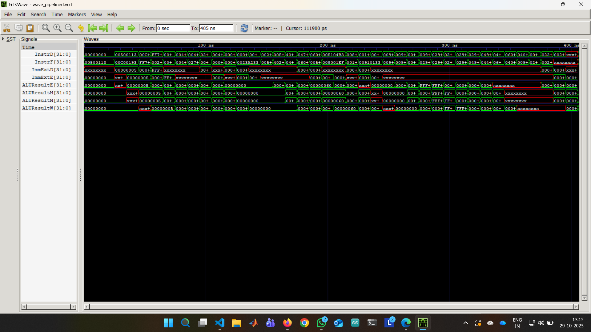
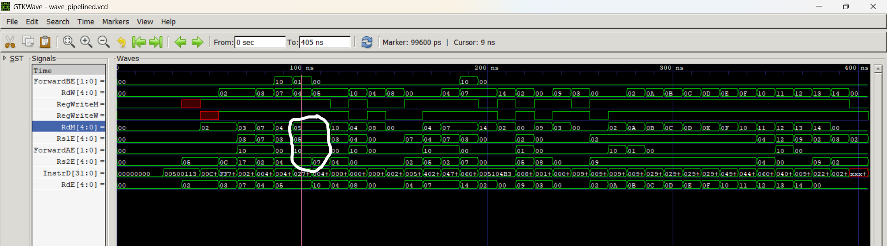
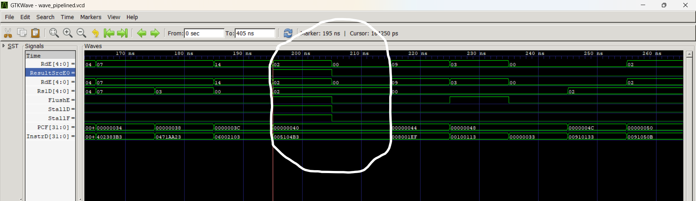

# Design Report: RVX10-P Pipelined Processor

**Author:** `ShivaGupthaKandibanda`
**Roll No:** `230102045`
**Course:** CS322M: Digital Logic and Computer Architecture
**Instructor:** Dr. Satyajit Das, IIT Guwahati

## 1. Design Description

### 1.1. Overview

The RVX10-P is a 5-stage pipelined processor core that implements the base **RV32I** instruction set along with the custom **RVX10** extension, which adds 10 new ALU instructions. This design partitions the datapath and control logic of a single-cycle processor into the five classic pipeline stages: **Fetch (IF)**, **Decode (ID)**, **Execute (EX)**, **Memory (MEM)**, and **Write-Back (WB)**.

The primary goal of this pipelined implementation is to improve instruction throughput by overlapping the execution of multiple instructions. To achieve this, pipeline registers are inserted between each stage, and dedicated hazard-handling logic (a Forwarding Unit and a Hazard Detection Unit) is implemented to manage data and control dependencies.

### 1.2. Module Hierarchy

The design is organized modularly, as seen in the `riscvpipeline.sv` file:

* **`riscvpipeline` (Top Module):**
    * Instantiates the main processor core (`riscv`), the instruction memory (`imem`), and the data memory (`dmem`).
* **`riscv` (Processor Core):**
    * This module contains the core pipelined logic, instantiating the `controller`, `datapath`, `forwarding_unit`, and `hazard_unit`.
* **`datapath`:**
    * Contains the structural components of the pipeline: PC register (`IF`), `regfile`, `alu`, immediate `extend` unit, and all pipeline registers (`IF_ID`, `ID_IEx`, `IEx_IMem`, `IMem_IW`).
* **`controller`:**
    * A pipelined control unit that decodes instructions in the ID stage (`maindec`, `aludec`) and passes control signals down the pipeline through its own set of control registers (`c_ID_IEx`, `c_IEx_IM`, `c_IM_IW`).

### 1.3. Pipeline Stages

The five stages are partitioned as follows:

1.  **IF (Instruction Fetch):**
    * Fetches the instruction from `imem` at the address specified by the `PCF` register.
    * Calculates the address of the next sequential instruction (`PC + 4`).
    * A mux selects the next PC, either `PC + 4` or the branch target `PCTargetE`.

2.  **ID (Instruction Decode):**
    * Decodes the fetched instruction using `maindec` and `aludec` to generate control signals.
    * Reads source registers (`Rs1D`, `Rs2D`) from the `regfile`.
    * Performs sign extension on the immediate value (`extend` unit).
    * The `hazard_unit` checks for load-use and control hazards at this stage.

3.  **EX (Execute):**
    * Performs the main operation in the `alu`.
    * The `forwarding_unit` controls muxes (`forwardMuxA`, `forwardMuxB`) to select the correct ALU operands, which may come from the ID/EX, EX/MEM, or MEM/WB registers.
    * Calculates the branch target address (`PCTargetE`).
    * Determines if a branch is taken (`PCSrcE`).

4.  **MEM (Memory Access):**
    * Accesses the `dmem` for load (`lw`) or store (`sw`) instructions.
    * For stores, `ALUResultM` is used as the address and `WriteDataM` as the data to write.
    * For loads, `ALUResultM` is the address, and the result is read from `ReadDataM`.
    * ALU results and `PC+4` (for `jal`) are passed through this stage.

5.  **WB (Write Back):**
    * Selects the final result to be written back to the `regfile` using the `resultmux`.
    * The result can be the ALU output (`ALUResultW`), data from memory (`ReadDataW`), or the `PC+4` value (`PCPlus4W` for `jal`).
    * The `RegWriteW` signal enables the write to the `regfile`.

### 1.4. RVX10 Extension

The 10 custom RVX10 instructions (`ANDN`, `ORN`, `XNOR`, `MIN`, `MAX`, `MINU`, `MAXU`, `ROL`, `ROR`, `ABS`) are all R-type instructions. They are handled entirely within the existing pipeline structure:
* **ID Stage:** The `aludec` identifies them using `ALUOp = 2'b11` and `funct7_2b`/`funct3` to generate a unique 4-bit `ALUControl` signal for each.
* **EX Stage:** The `alu` module implements the logic for all 10 operations based on the `alucontrol` signal.
* No changes are needed in any other stage, as they follow the same datapath as a standard R-type instruction.

---

## 2. Hazard Handling Logic

Hazard handling is critical for a functional pipeline and is managed by the `forwarding_unit` and `hazard_unit`.

### 2.1. Data Hazards (Forwarding)

Data hazards are resolved by forwarding results from later stages back to the inputs of the EX stage. This is managed by the `forwarding_unit`.

* **EX/MEM Hazard:**
    * **Detection:** Occurs if an instruction in EX needs a result from an instruction still in MEM.
    * **Logic:** `if ((Rs1E == RdM) & RegWriteM & (Rs1E != 0))`. A similar check is done for `Rs2E`.
    * **Action:** `ForwardAE` (or `ForwardBE`) is set to `2'b10`. This selects the `ALUResultM` from the EX/MEM register as the input to the ALU.

* **MEM/WB Hazard:**
    * **Detection:** Occurs if an instruction in EX needs a result from an instruction in WB (and it wasn't caught by the EX/MEM hazard logic).
    * **Logic:** `else if ((Rs1E == RdW) & RegWriteW & (Rs1E != 0))`. A similar check is done for `Rs2E`.
    * **Action:** `ForwardAE` (or `ForwardBE`) is set to `2'b01`. This selects the `ResultW` from the MEM/WB register as the input to the ALU.

### 2.2. Data Hazards (Load-Use Stall)

A load-use hazard cannot be resolved by forwarding alone, as the data from a `lw` instruction is not available until the end of the MEM stage.

* **Detection:** The `hazard_unit` detects this condition in the ID stage.
* **Logic:** `lwStall = (ResultSrcE0 == 1) & ((RdE == Rs1D) | (RdE == Rs2D))`. This checks if the instruction in EX is a load (`ResultSrcE0`) and if its destination register (`RdE`) matches either source register of the instruction in ID (`Rs1D`, `Rs2D`).
* **Action:** When `lwStall` is asserted:
    1.  **`StallF = 1`:** Freezes the PC register (`IF` module).
    2.  **`StallD = 1`:** Freezes the IF/ID pipeline register (`pipreg0`).
    3.  **`FlushE = 1`:** Clears the ID/EX pipeline register (`pipreg1` and `c_pipreg0`), inserting a bubble (NOP) into the EX stage.
    This combination effectively stalls the IF and ID stages for one cycle while letting the `lw` instruction proceed to MEM.

### 2.3. Control Hazards (Branch/Jump)

Control hazards occur when a branch or jump changes the program counter. The branch decision is made in the EX stage.

* **Detection:** The `controller` asserts `PCSrcE` if a branch is taken (`BranchE & ZeroE`) or if it's a jump (`JumpE`).
* **Action:** When `PCSrcE` is asserted by the controller:
    1.  **PC Mux:** The `pcmux` in the IF stage selects `PCTargetE` (the calculated branch address) as the `PCNextF`.
    2.  **`FlushD = 1`:** The `hazard_unit` asserts `FlushD`. This clears the IF/ID register (`pipreg0`) and inserts a NOP, effectively canceling the instruction that was fetched from the wrong path.
    3.  **`FlushE = 1`:** The `hazard_unit` also asserts `FlushE`. This clears the ID/EX register, canceling the instruction that had just entered the ID stage.

---

## 3. Performance Counters

The optional performance counters were implemented in the `riscv` module.

* `cycle_count`: This is a 32-bit register that increments on every rising clock edge.
* `instr_retired`: This 32-bit register increments when an instruction successfully reaches a stage that confirms its completion. The logic used is:
    ```verilog
    if (RegWriteW | MemWriteM | PCSrcE) begin
        instr_retired <= instr_retired + 1;
    end
    ```

    This counts instructions that write to a register (`RegWriteW`), write to memory (`MemWriteM`), or are taken branches/jumps (`PCSrcE`), covering all instruction types.

---

## 4. Verification & Waveforms

The processor was verified using the provided `testbench_pipelined`, which loads a test program, executes it, and checks for the success criteria: **a write of value `25` to data memory address `100`**.


### 4.1. Overall Pipeline Execution

This waveform shows multiple instructions executing concurrently in different pipeline stages, demonstrating successful overlapping.



This waveform shows the pipeline registers at different stages (IF, ID, EX, MEM). You can see different instructions (e.g., 00500113, 00C00193, FF718393) active in different stages simultaneously, clearly demonstrating overlapped execution.

### 4.2. Data Hazard: Forwarding

This waveform captures the `forwarding_unit` resolving a data hazard. Note how `ForwardAE` (or `ForwardBE`) becomes `2'b10` (for EX/MEM) or `2'b01` (for MEM/WB), and the corresponding `SrcAE` mux output selects the forwarded data instead of the stale data from the register file.



This waveform captures the EX/MEM forwarding logic. The instruction in EX needs a result from the instruction in MEM.

    - The hazard is detected (Rs1E=5 matches RdM=5, and RegWriteM=1).

    - The forwarding unit reacts by setting ForwardAE to 2'b10, successfully routing the ALUResultM back to the ALU input.


### 4.3. Data Hazard: Load-Use Stall

This waveform shows the `hazard_unit` detecting a load-use dependency. The `lwStall` signal goes high, causing `StallF` and `StallD` to assert (freezing IF/ID) and `FlushE` to assert (inserting a bubble).



This waveform shows the load-use stall mechanism.

    - A load (lb) is in the EX stage (ResultSrcE0=1, RdE=2).

    - The instruction in the ID stage needs this result (Rs1D=2).

    - The hazard unit correctly asserts StallF, StallD, and FlushE. This stalls the PC (PCF) and the InstrD register for one cycle, while FlushE inserts a bubble into the pipeline.


### 4.4. Control Hazard: Taken Branch

This waveform shows the pipeline flushing after a branch is taken. The `PCSrcE` signal asserts in the EX stage, which triggers `FlushD` and `FlushE`, clearing the two incorrectly fetched instructions from the IF/ID and ID/EX registers.


This waveform demonstrates the control hazard flush from a jal instruction.

    - When the jump is resolved in the EX stage, the FlushD signal is asserted for one cycle.

    - This clear signal causes the IF/ID register (InstrD) to discard the incorrectly fetched instruction (00100113) and instead load a nop (00000033), successfully flushing the pipeline.